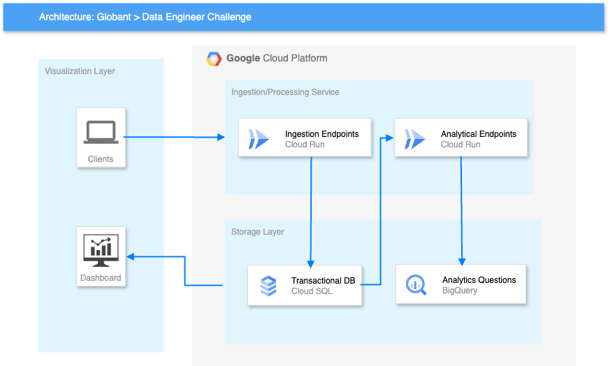
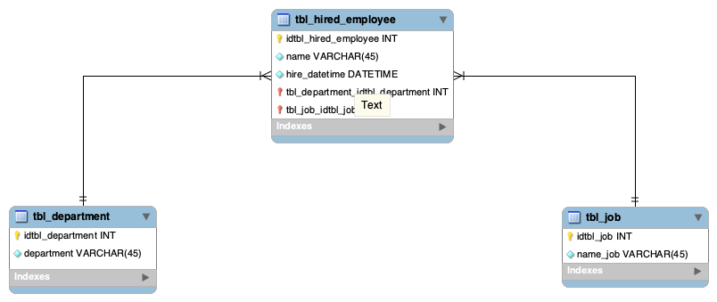

# Globant Data Engineer Challenge | Google Cloud

This repository contains resources to solve a proof of concept about data migration and solving data engineer challenge shared by Globant. I'll let you know how to deploy the service, what database design I decided, solution architecture and how to run it.

## System requirement

The solution was built in a Apple Sillicon M1 processor, it means if you would like to run in an intel proccessor you should use docker build instead of docker buildx as I did during this proof. Following, I give some details to take in consideration before start:

1. Install docker or colima in case you want
2. Install a http client or validate if you know how to run curl in your own terminal
3. Install a RDBM workbench which you prefer to connect with the DB
4. Install Python 3.11
5. Poetry 1.8.2
6. If you are on windows, keep in Mind that Makefile won't work there


## Solution Architecture

The proposal is based on Google Cloud but you are also able to deploy in your own host (local) you'll find more details in [how to execute](#how-to-execute) section. So, I start with a high level architecture to have an idea of entire solution. 



I've created two high level layers in the cloud provider, storage layer and ingestion/processing layer. 

* Storage Layer: It contains the transactional SQL database as the challenge required, and a analytical ecosystem (Bigquery) to save the second part of the challenge.

* Ingestion/processing layer: It contains a Flask API to enable file ingestion, backup and bulk insert into database. 

### Database ERM

Entity Relationship Model is so simple, since we have only three tables (Jobs, Department and Hired Employees). I'll let you know a proposal below:



It's similar to have a small dimensional model (star model) with fact table (hired) and two dimensional tables (Job and department).

## Challenge solution

I've implemented the solution using Python 3.11, Poetry 1.8 and Flask as principal stack with Google Cloud Platform, but I've enabled local and cloud executions. However, the database only exist in GCP,  it means that local app will be connected with gcp and you need a Service Account with permissions for that. I've not posted a service account in this repo but I can share it if you want through email.

### API Endpoints for solving the challenge

Keeping in mind above explanation, I've solved the challenge creating an API and I deployed it in Cloud Run (Serverless service to save cost). I'm going to explain each point of the challenge listing the question and giving my answer:

1. You are a data engineer and you are about to start an important project. This project is big data migration to a new database system. You need to create a PoC to solve the next requirements:

    1.  Move historic data from files in CSV format to the new database.
    
    `/upload` this endpoint is a POST method, you should send form-data parameters uploading the file directly from your laptop (job,department or hired_Employee) in CSV format and it will be sending using https to the database.

    2.  Create a Rest API service to receive new data. This service must have:

    `/bulk` this endpoint is a POST method, you should send a dictionary with following structure:

    ```
    {
        "table": "<table_name>",
        "data": [<row1>, <row2>,...,<rowN>]
    }
    ```
    It inserts the records into table selected hosted in google cloud SQL using the internal connection.

    3.  Create a feature to backup for each table and save it in the file system in AVRO format.

    `/backup` this endpoint is a POST method, you should send a dictionary with following structure:

    ```
    {
        "table": "<table_name>"
    }
    ```

    It creates a backup and inserting it into google cloud storage as a avro file.

    4.  Create a feature to restore a certain table with its backup
    
    `/restore` is a POST method, it allows you to restore the latest backup into database. You should send a dictionary with following structure:

    ```
    {
        "table": "<table_name>"
    }
    ````
2. You need to explore the data that was inserted in the first challenge. The stakeholders ask for some specific metrics they need. You should create an end-point for each requirement.

    1. Number of employees hired for each job and department in 2021 divided by quarter. The table must be ordered alphabetically by department and job.

    `/hires_q` end-point was created as GET method, it fills a Bigquery table with the results and it returns a confirmation when the job was executed entirely. It was built with a dinamic query and you can send the year as parameter in case you want to analyze an specific year. The format is shown below:

    ```
    {
        "year": 2021
    }
    ```

    2. List of ids, name and number of employees hired of each department that hired more employees than the mean of employees hired in 2021 for all the departments, ordered by the number of employees hired (descending).

    `/hires_depa` end-point was created as GET method. It fills a Bigquery table with the results and it returns a confirmation when the job was executed entirely. It was built with a dinamic query and you can send the year as parameter in case you want to analyze an specific year. The format is shown below:

    ```
    {
        "year": 2021
    }
    ```

### Outcomes

There are 2 main resources for this challenge:

1. [Public Url to execute endpoints](https://gcp-glob-challenge-37311616965.us-east1.run.app)

2. [Dashboard in looker studio](https://lookerstudio.google.com/reporting/cd890dbc-d758-47d0-b6cb-c2096d4cf9a1)


## How to execute 

There is a Makefile, it contains all commands to run locally, build, tag and push the images to the container registry in GCP, and finally a command to deploy a new version of cloud run service. The commands will be described below:

* Clone this repo
```
git clone https://github.com/jessnermejia/glob_challenge.git
```

* Go to the folder
```
cd glob_challenge
```

* If you want to run as Python script: 
    - Create a poetry environment
    ```
    poetry shell
    ```

    - Install the libraries in your new environment
    ```
    poetry install
    ```

    - Read the [final notes](#final-notes) in this section, you should create these files.

    - Run main script
    ```
    python app/main.py
    ```
 
* To build a docker image in local, run: 
```
make build_local_app
```

* To execute the latest image in local, run:
```
make run_local_app
```

* To build the image for GCP service, run:
```
make build_gcp_app
```

* To push the image to GCP, run:
```
make build_and_push_gcp
```

* To deploy a new Cloud Run version:
```
make deploy_app
```

* Just for the first time pushing in GCP:
```
make configure_docker
```

### Final notes

Last but not least, if you are going to execute the app locally, you should create a folder named `.creds` to save the credentials, and should create `.env`file with the following structure:

```
DB_USER = "<replace with user>"
DB_PASS = "<replace with pass>"
DB_NAME = "<replace with db name>"
INSTANCE_CONNECTION_NAME = "<replace with instance connection name>"
GCP_CREDENTIALS = ""
```

Finally, I would like to thank you for exploring this repo and any doubt you could email me, my mail is written in pyproject.toml.

Best,

